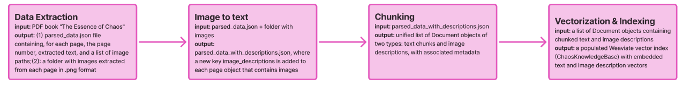
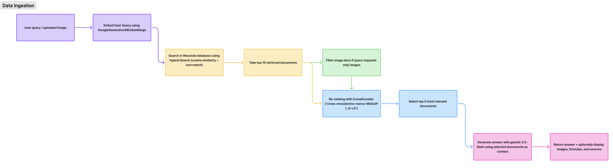

# ChaosRAG: Chaos Theory Assistant
A RAG application that allows you to interact with a knowledge base based on Edward Lorenz's book "The Essence of Chaos"

## Project SetUp

1. Clone the repo
```bash
https://github.com/yanakravrts/ChaosRAG.git
```

2. Environment setup
```bash
1. cd path_to/ChaosRAG

2. poetry config virtualenvs.in-project true

3. poetry install
```

3. Create `.env` file from `.env.example`:

4. Run application 
```bash
docker-compose up --build
```

## Pipeline
1. Data Ingestion


3. Inference


## [Demo](https://drive.google.com/drive/folders/1K7z0Pp59aC4oXuiucdpUjWLZ1BRQGRJu?usp=share_link)

## [Deployed version](https://chaosrag-xbxglisjnvdqnusgtscmgx.streamlit.app)
